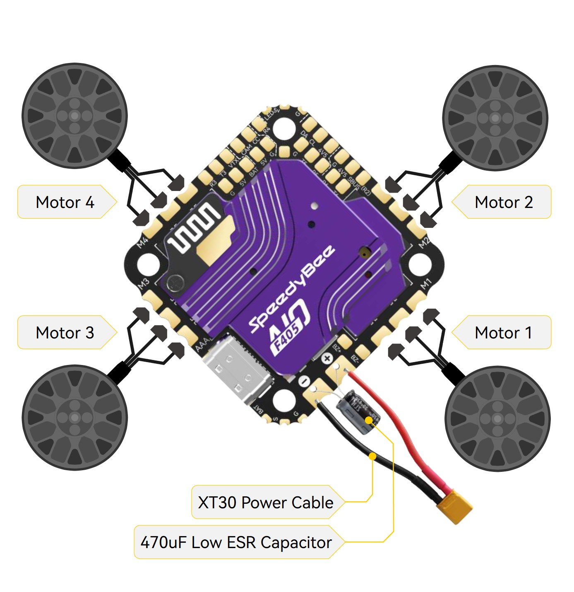
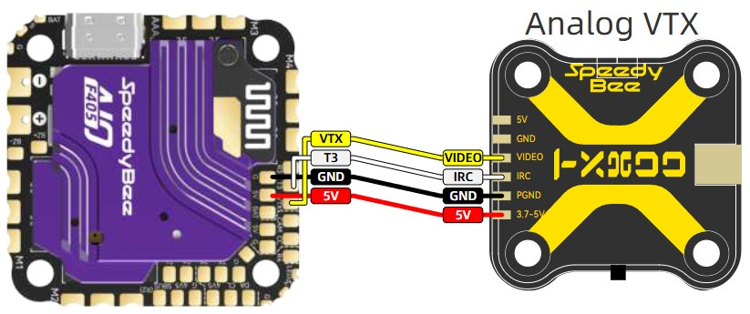
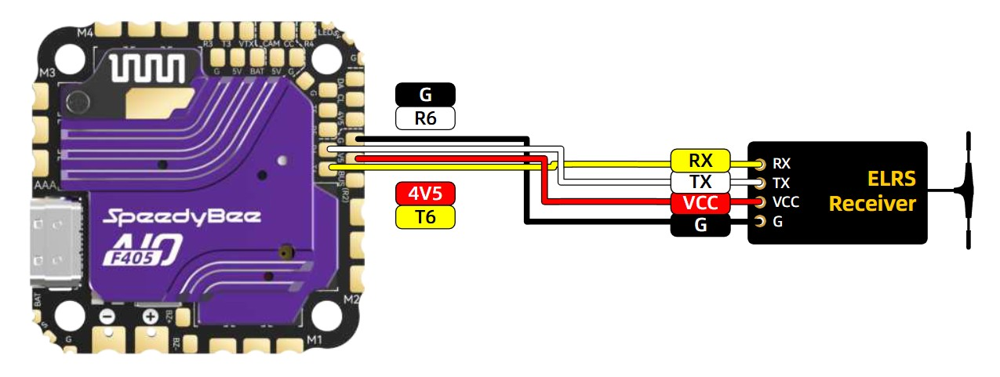
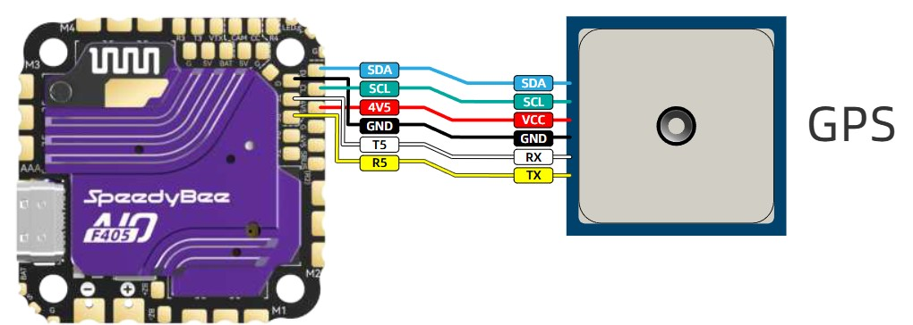

+++
title = "The Drone" 
date = "2025-05-15"
+++

This section details the hardware setup utilized in our project. It covers the selected components, their specifications, interconnections, and the rationale behind each design choice to ensure optimal performance and compatibility.

Due to current German aviation regulations, our drone must not exceed a total weight of 250 grams. This threshold allows operation without formal registration or special permits, significantly simplifying compliance while still enabling a fully functional and capable system within strict weight constraints.

# Hardware Components

- Frame: `Volador II VX5 FPV Freestyle T700 Frame Kit-Black`
    + The frame serves as the structural foundation of the drone, providing mounting points for all essential components such as motors, flight controller, battery, and sensors. It must be both lightweight and durable to meet the strict 250 g weight limit while ensuring mechanical stability during flight.  
    + In our case, we use a 5-inch (5 Zoll) frame with a total weight of 177.4 g, which offers a good balance between size, stability, and compatibility with standard components. The frame costs 76.90 €, making it a solid mid-range option in terms of both performance and price.

- Propellers: `Hurricane 51477-3 Clear Blue PC 2L2R`
    + The propellers are a critical component for generating lift and ensuring stable flight dynamics. We use 5-inch (5 Zoll) tri-blade propellers, which offer a good compromise between thrust, efficiency, and responsiveness.  
    + In our case, each propeller weighs 4.1 g, contributing minimally to the overall weight budget.

- Propeller motors: `4x XING E-Pro 2308 2450kv`
    + Propeller motors are responsible for driving the propellers and generating the thrust required for lift and maneuvering.  
    + Each motor weighs 33.6 g, resulting in a total motor weight of 134.4 g.

- Flight controller: `SPEEDYBEE F4-40A-AIO`
    + We use the SPEEDYBEE F4-40A AIO (All-In-One) flight controller to manage all aspects of the drone’s flight. It integrates the flight control unit and a 40A electronic speed controller (ESC) into a single board, reducing weight and simplifying wiring. 
    + The board weighs only 13.6 g, making it a highly efficient choice for lightweight drones.

- Video transmitter: `SpeedyBee TX800 FPV VTX`
    + We use the transmitter to send the live video feed from the drone’s camera to the pilot’s goggles. 
    + The used transmitter has a weight of only 5.6g, which makes it a perfect fit for the weight requieremnts we have.

- Camera:
    + `Caddx Ratel PRO MN01 - 4000B` 
    + `Raspberry Pi Camera: RB-Camera_JT-V2-120` 
        - We use these two cameras in our project. The first camera is dedicated to capturing and transmitting live video feed to the pilot’s goggles, while the second camera is used exclusively for the AI application running on the Raspberry Pi. 
        - The Caddx Ratel PRO MN01 - 4000B weighs approximately 9.5 g, while the Raspberry Pi Camera RB-Camera_JT-V2-120 has a weight of about 4 g.

- GPS modul: ``
    + We have integrated a GPS module into the system, intended to support the AI application. This enables autonomous flight capabilities, allowing the drone to navigate from point A to point B without manual control.
    + weight??? 

- Single board computer: `Raspberry Pi Zero WH PI3G`
    + The single board computer is used as the computing platform for our AI application. Details about its role and the software implementation will be explained further in the software section of this documentation. 
    + weight?

- AI accelerator: `Coral Google Edge TPU ML accelerator`
    + To accelerate the AI application, we use the Coral Google Edge TPU machine learning accelerator, which significantly boosts inference speed and efficiency.

- Storage: `Samsung microSDHC EVO+ MB-MC32GA/EU`
    + ???

- Batteries:
    + heavy: `R-LINE Tattu 95C - 750mAh` 
    + light: `Gaoneng LiPo Akku 4S 650mAh 15.2V` 
        - Both batteries can be used interchangeably to power either the drone or the controller. 
        - The R-LINE Tattu 95C 750mAh battery has a net weight of approximately 82 g (±10), while the Gaoneng LiPo Akku 4S 650mAh 15.2V battery weighs around 70 g (±3).

- Remote controller: `Radiomaster Boxer ELRS GRYM2`
    + The Radiomaster Boxer ELRS GRYM2 is used to control the drone during flight. It sends commands to the flight controller via the ExpressLRS protocol, enabling precise and reliable manual operation.

- Goggles: `FATSHARK ECHO FPV Video Headset - Part Number: FSV1131-04`
    + We use the Fatshark Echo goggles to receive the live video feed transmitted from the drone’s onboard camera.

- Charger: `SKYRC S100 neo AC/DC Smart Balance Charger`
    + The charger is used to power all the necessary batteries for our setup, or example, those used in the drone itself as well as the controller.

- Smoke Stopper: `TBS Smoke Stopper`
    + To protect our electronic components during initial power-up and testing, we used the TBS Smoke Stopper. This device acts as an in-line fuse and current limiter, helping to prevent damage caused by short circuits or wiring mistakes.

This results in a current total drone weight of approximately `<???>`. The overall cost of the components is at `<???>€`.

# Drone Construction Overview

- Flight Controller:
    + To connect the propeller motors to the flight controller, the propeller motors wires were soldered directly to the flight controller. The has specific solder pads for this purpose, making it easy to attach the motor wires directly to the board. The motor mapping - defining which motor corresponds to which output - an be configured either in Betaflight or conveniently through the SpeedyBee app on a smartphone. In addition to the motors, it was also necessary to solder a power cable and a capacitor to the flight controller. Both components share the same solder pads, so they had to be carefully connected to ensure proper power delivery.

    + 

- Video Transmitter:
    + To connect the video transmitter to the flight controller, four cables were used: black, red, white, and yellow.
        + The black cable connects the GND pad on the video transmitter to a GND pad on the flight controller, ensuring a common ground.
        + The red cable supplies power by connecting the 5V output on the flight controller to the 5V input on the video transmitter. This means the flight controller also functions as a power supply for the VTX, eliminating the need for a separate power source.
        + The white cable connects the IRC pad (for control commands) on the video transmitter to the T3 pad on the flight controller. This allows the flight controller to send configuration commands to the VTX, such as changing channels or power levels.
        + The yellow cable connects the VTX pad on the flight controller to the video input pad on the video transmitter. This carries the video signal from the onboard camera, which is then transmitted to the FPV goggles.

    + 

Camera `Caddx Ratel PRO MN01 - 4000B`:
    + 

+ ELRS Receiver:
    + 

- GPS modul:
    + 